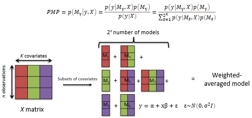
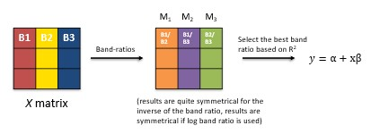
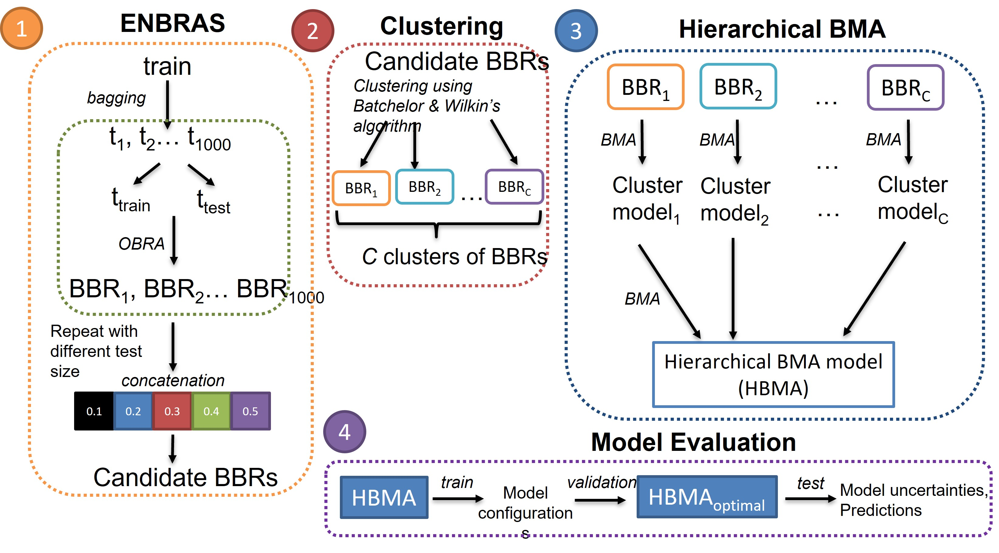

# HBMA-OMBRA

According to this common saying: *“All models are wrong, but some are useful”* 

How about we combine the candidate models that are useful? And this naturally lends to the idea of Bayesian Model Averaging, where we combine multiple competing models together. And this intuitively makes sense because there is no one best model for all scenarios.

## Bayesian Model Averaging (BMA)
---

Bayesian Model Averaging or BMA is an ensemble machine learning model that combines multiple competing models together to make a more robust prediction. 

## Optimal Band Ratio Analysis (OBRA)
---
Optimal Band Ratio Analysis, or OBRA in short is a relatively popular model for TSS prediction because it is easy to implement, and band-ratios are quite robust to various spectral shapes associated to different optically complex water body medium.

## Conceptual framework of HBMA-OMBRA
---

The formulation of HBMA-OMBRA is composed of three parts
1. we propose a formulation for the dimensionality reduction called ENsemble Band RAtio Selection (ENBRAS). ENBRAS is conducted to identify various candidate best band ratios (BBR) through bagging/bootstrapping procedures
2. Clustering of candidate BBRs is carried out via Batchelor and Wilkin’s algorithm. This helps to identify clusters of candidate BBRs
3. Hierarchical BMA is performed, i.e., BMA is conducted for each cluster of candidate BBRs to produce the final hierarchical model. 

(*Source*: Pak, H.Y., Law, A.W.K., and Lin, W. (2022). Retrieval of Total Suspended Solids Concentration from Hyperspectral Sensing using Hierarchical Bayesian Model Aggregation for Optimal Multiple Band Ratio Analysis Submitted to the Journal of Hydro-environment Research, currently under review.)

## Usage
+ In your preferred IDE, run `ENBRAS_Clustering.ipynb` for conducting ENBRAS and Clustering using the modified Batchelor & Wilkin's algorithm.
+ BMA is facilitated with the [*BMS*](https://cran.r-project.org/src/contrib/Archive/BMS/) package in `R` (Feldkircher & Zeugner, 2015). R notebooks have been provided under the folder *Rnotebooks* to demonstrate how BMA is being conducted.
+ Documentation for *BMS* is rather extensive and users can find more information from the documentation and tutorials [herein](http://bms.zeugner.eu/).